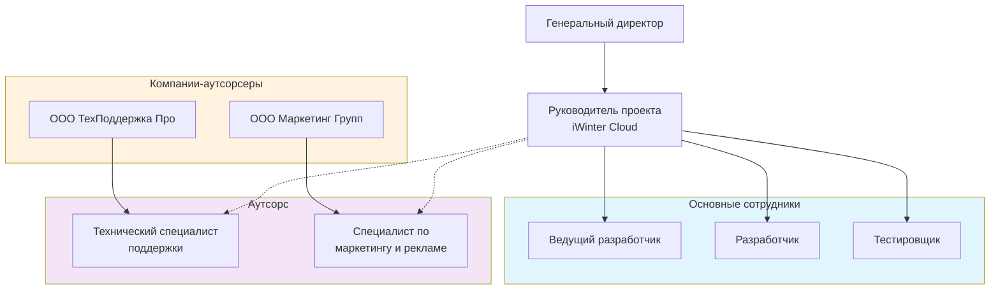

1. Составить схемы моделей жизненного цикла и выделить преимущества и недостатки каждой (водопадная, поэтапная, итерационная, спиральная)
2. Выбрать продукт, сделать его характеристику. Выбрать один из типов организац. структуры для своего продукта, определить "+" и "-" стороны (линейная, линейно-функциональная, линейно-штабная, матричная, проектная)
3. Сделать общую характеристику вашего предприятия (организации)
	   * основная продукция (товары, работы или услуги)
	   * потребители продукции
	   * конкуренция, реклама
4. По выбранной структуре нужно определить и классифицировать ваш персонал и представить в виде схемы

## 1. Схемы моделей жизенного цикла
#### 1.1. Каскадная, или водопадная, модель
Каскадная модель устроена как классический последовательный процесс. Это значит, что движение происходит только вперед от одного этапа к следующему. При работе по каскадной модели на последнем этапе заказчик получает готовое решение, которое не требует доработок.

Принцип простой, но строгий, поэтому некоторые считают его устаревшим. Однако он все еще подходит для некоторых проектов в самостоятельном виде или в сочетании с гибкими методиками.
![[Pasted image 20251123160650.png]]
**Плюсы:**
- Полное документирование каждого этапа до начала разработки;
- Низкий риск ошибок за счет детальной документации;
- Прозрачность процессов для заказчика — он знает, сколько времени уйдет на каждый этап.
**Минусы:**
- Перед стартом нужно подготовить обширную техническую документацию, что занимает много времени;
- Сложно учесть все требования до старта разработки;
- Нет гибкости — если появились новые требования на этапе разработке, то откатить работу назад не получится;
- Заказчик видит результат в конце разработки — если итог его не устроит, придется начинать сначала.
**Когда подходит водопадная модель:**
- Есть четкие и заранее известные требования, которые не будут меняться на этапе разработки.
- Работа должна идти по строгим регламентам — такое требование может быть актуальным для госучреждений или банковских систем.

#### 1.2. Инкрементная (поэтапная) модель
При работе по этой модели продукт создают по частям, или инкрементам. Каждая часть добавляет новую функциональность к уже существующей системе. В отличие от итеративной модели, где каждая итерация может пересматривать и улучшать предыдущие результаты, в инкрементной модели каждая часть — это законченный кусок функционала, который можно использовать.

Если итеративная модель подразумевает выпуск продукта целиком, но в неидеальном виде, то инкрементная подразумевает выпуск продукта частями, где каждая часть не требует доработо

**Плюсы:**
- Пользователи могут начать использовать продукт уже после первого инкремента;
- Заказчик видит прогресс и может вносить правки в следующие инкременты.
**Минусы:**
- Если команды параллельно работают над разными инкрементами, есть риск того, что модули будет сложно связать;
- Необходимо тщательное планирование, чтобы заранее определить, какие функции будут в каждом инкременте, и учесть их в архитектуре.
**Когда подходит модель:**
- Рабочее решение нужно в короткие сроки;
- Требования не до конца ясны и могут меняться в процессе работы;
- Проект большой, а ресурсов немного, поэтому приходится разбивать продукт на части и делать его постепенно.

#### 1.3. Итеративная модель
В отличие от водопадной модели, итеративная позволяет обновлять требования к продукту после старта разработки. Для этого проект дробят на части и сначала выпускают MVP-версию, а затем итерациями доводят решение до ума. По ходу разработки требования к ПО можно менять в зависимости от обратной связи пользователей, заказчика или изменений на рынке. Цикл повторяется до тех пор, пока вся система не будет готова.

Получается так, что каждая итерация — это мини-проект, который включает анализ, проектирование, разработку, тестирование и выпуск готового к эксплуатации продукта.

При итеративном подходе пользователям как можно быстрее поставляют весь продукт, пусть и не в идеальном виде. Затем с каждой итерацией он становится лучше и лучше
**Плюсы:**
- Возможность быстро выкатить ПО;
- Заказчик видит промежуточные результаты и может корректировать требования;
- Быстрая обратная связь от пользователей;
- Проще находить конфликты между требованиями.
**Минусы:**
- Могут возникнуть сложности с созданием рабочей архитектуры, так как изначально не всегда известны все требования.
**Когда подходит модель:**
- Рабочее решение нужно в короткие сроки;
- Требования не до конца ясны и могут меняться в процессе работы;
- Проект очень большой, а ресурсов немного, поэтому приходится разбивать продукт на части и делать его постепенно.

### 1.4. Спиральная модель
Модель объединяет в себе преимущества каскадной и итеративной моделей, но делает большой упор на анализ рисков. То есть, команда уделяет много времени планированию и при этом в будущем может дорабатывать решение. Еще одна особенность модели в том, что процесс разработки делится на циклы, которые изображают как витки спирали. И каждый виток состоит из четырех этапов:
- планирование;
- анализ рисков;
- разработка и тестирование;
- оценка и планирование следующего витка.

Каждый виток = новая версия продукта
**Плюсы:**
- Риски находят на ранних этапах, что снижает вероятность проблем в будущем;
- Можно вносить изменения в проект по мере его развития;
- Подходит для крупных систем, где много неопределенности и высокие требования к надежности.
**Минусы:**
- Многочисленные циклы растягивают разработку и делают ее дороже;
- Каждое новое требование заказчика запускает новый виток. Это делает разработку дороже, так как нужно снова тратить ресурсы на анализ.
**Когда подходит эта модель:**
- Пользователи сами не до конца понимают, что им нужно;
- Требования к проекту слишком сложные и могут меняться по ходу работы;
- Успех проекта не гарантирован, и нужно заранее оценить риски, чтобы решить, стоит ли продолжать работу;
- В проекте используют новые технологии, которые еще не до конца изучены, и есть риск, что они не дадут ожидаемого результата.

## 2. Выбор продукта и характеристика
Продукт - Cloud
Компания: ООО "iWinter"

iWinter Cloud — облачное решение для создания и обмена образовательными курсами и презентациями. Основные возможности:
- Создание и редактирование обучающих курсов онлайн,
- Поддержка форматов SCORM и xAPI для LMS,
- Совместная работа в команде над контентом,
- Автоматическое распознавание и сохранение форматирования текстов,
- Распространение и статистика по контенту,
- Перевод курсов на разные языки.

Это платформа для удобного создания, публикации и совместного контроля обучающих материалов через браузер, ориентированная на корпоративное обучение и презентации.

Для продукта решено выбрать **проектную структуру** организации.

**Преимущества проектной структуры:**
- Четкое подчинение и единство руководства
- Быстрое принятие решений
- Высокая концентрация на цели проекта
- Простота управления и координации
- Минимизация конфликтов из-за четких зон ответственности
**Недостатки проектной структуры:**
- Ограниченные возможности для обмена знаниями между разными проектами
- Риск дублирования функций в разных проектных командах
- Менее гибкое использование ресурсов между проектами
## 3. Характеристика предприятия
#### Основная продукция

Разработка и предоставление облачной платформы для создания, редактирования и распространения обучающих курсов, презентаций и образовательного контента. Это SaaS-продукт с поддержкой стандартов электронного обучения SCORM и xAPI, ориентированный на корпоративное обучение и дистанционные образовательные программы.
#### Потребители продукции
Основными потребителями являются:
- Корпоративные клиенты — компании, которые используют платформу для обучения и повышения квалификации своих сотрудников,
- Образовательные учреждения для создания онлайн-курсов,
- Консалтинговые и тренинговые компании,
- Авторы и разработчики обучающих материалов, нуждающиеся в удобных инструментах для создания и публикации контента.
#### Конкуренция и реклама
Конкуренция идет с другими платформами для создания и распространения электронных курсов, такими как Moodle, TalentLMS, Articulate. Конкурентные преимущества ООО iWinter строятся на удобстве использования, гибкости и возможности совместной работы.

Рекламные каналы включают:
- Целевую рекламу в профессиональных сообществах и соцсетях,
- SEO-продвижение по ключевым запросам электронного обучения,
- Участие в отраслевых конференциях и выставках,
- Партнерские программы с образовательными и корпоративными клиентами,
- Демонстрационные версии и бесплатные пробные периоды для привлечения пользователей.

## 4. Персонал

#### Классификация персонала
- Основные сотрудники:
    1. Генеральный директор (руководит всей компанией, принимает стратегические решения)
    2. Руководитель проекта (курирует итерационный цикл разработки продукта)
    3. Ведущий разработчик (разработка и поддержка функционала платформы)
    4. Разработчик (программист) — поддержка и развитие функционала
    5. Тестировщик - контроль качества продукта и тестирование
- Вспомогательные сотрудники:
    1. Технический специалист поддержки (решение технических вопросов пользователей)
	2. Специалист по маркетингу и рекламе (продвижение продукта и работа с клиентами)

